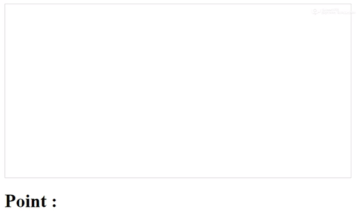

# toti
Toti is a game about neuralnetwork with brain.js

This is a game based on an artificial neural network.
- coded via brain.js engine.
- the player is asked to collect the most successful lines.
- 50 birds are first given brain.
- the brain of the most successful bird is taken every round.
- This brain is mutated at a rate of 0.1 and a new brain is created.
- In each round, new birds with this brain are created.
- Super bird has the ability to collect all the lines.

